# 🌌 Kiến Trúc Lục Giác với Go - Khám Phá Toàn Diện về Kỹ Thuật Backend và Hệ Thống Phân Tán

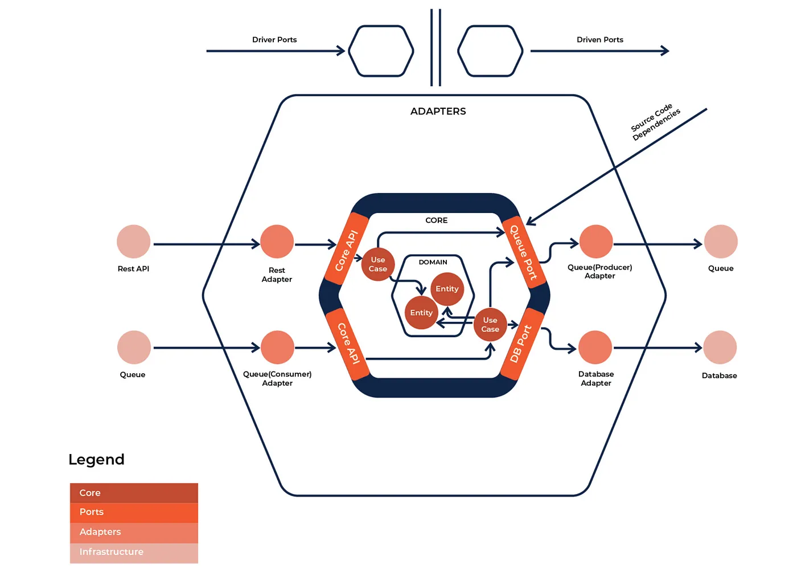
Đây là mã nguồn cho bài viết gốc:

[Kiến Trúc Lục Giác Chuyên Sâu với PostgreSQL, Redis và Go](https://medium.com/towardsdev/hexagonal-architecture-deep-dive-with-postgresql-redis-and-go-practices-4b051f940e93)

Lưu ý rằng codebase đã phát triển phức tạp hơn so với ví dụ trong bài viết. Bài viết chỉ là điểm khởi đầu cho dự án.

## 🏡 Kiến Trúc Lục Giác là gì?

Kiến Trúc Lục Giác, còn được gọi là Kiến Trúc Ports and Adapters hoặc Clean Architecture, là một mẫu kiến trúc phần mềm thúc đẩy sự liên kết lỏng lẻo giữa lõi ứng dụng (logic nghiệp vụ) và các thành phần bên ngoài như giao diện người dùng, cơ sở dữ liệu và các dịch vụ bên ngoài.

Trong Kiến Trúc Lục Giác, lõi của ứng dụng được tách biệt khỏi các thành phần bên ngoài và thay vào đó được truy cập thông qua một tập hợp các giao diện hoặc cổng được định nghĩa rõ ràng. Các adapter sau đó được sử dụng để triển khai các giao diện cần thiết và tích hợp với các thành phần bên ngoài.

## 🔮 Các Thành Phần của Kiến Trúc Lục Giác

Dưới đây là các thành phần của Kiến Trúc Lục Giác:

### 🎖 Logic Nghiệp Vụ Lõi:

Logic Nghiệp Vụ Lõi chịu trách nhiệm về chức năng chính của ứng dụng. Thành phần này đại diện cho trái tim của ứng dụng và nên được thiết kế độc lập với bất kỳ phụ thuộc bên ngoài nào. Trong Kiến Trúc Lục Giác, Logic Nghiệp Vụ Lõi được triển khai dưới dạng tập hợp các use case đóng gói hành vi của ứng dụng.

Ví dụ, nếu chúng ta đang xây dựng một ứng dụng ngân hàng, Logic Nghiệp Vụ Lõi sẽ bao gồm các use case như tạo tài khoản, chuyển tiền và kiểm tra số dư tài khoản.

### 👯 Adapters:

Các Adapter chịu trách nhiệm kết nối Logic Nghiệp Vụ Lõi với thế giới bên ngoài. Adapter có thể thuộc hai loại: Primary và Secondary.

#### 🕺 Primary Adapter:

Primary Adapter chịu trách nhiệm xử lý các yêu cầu đến từ thế giới bên ngoài và gửi chúng đến Logic Nghiệp Vụ Lõi. Trong Kiến Trúc Lục Giác, Primary Adapter thường là một HTTP server, nhận các yêu cầu HTTP từ client và chuyển đổi chúng thành các yêu cầu mà Logic Nghiệp Vụ Lõi có thể hiểu được.

Ví dụ, trong một ứng dụng ngân hàng, Primary Adapter sẽ là một HTTP server lắng nghe các yêu cầu đến từ client, chẳng hạn như chuyển tiền hoặc kiểm tra số dư tài khoản, sau đó chuyển đổi chúng thành các use case mà Logic Nghiệp Vụ Lõi có thể hiểu.

#### 🥁 Secondary Adapters:

Secondary Adapters chịu trách nhiệm giao tiếp với các phụ thuộc bên ngoài mà Logic Nghiệp Vụ Lõi dựa vào. Các phụ thuộc này có thể là cơ sở dữ liệu, hàng đợi tin nhắn hoặc các API bên thứ ba. Secondary Adapters triển khai các cổng (ports) được định nghĩa bởi Logic Nghiệp Vụ Lõi.

Trong một ứng dụng ngân hàng, Secondary Adapters sẽ bao gồm các database adapter giao tiếp với Logic Nghiệp Vụ Lõi để lưu trữ và truy xuất dữ liệu về tài khoản, giao dịch và các thông tin liên quan khác.

### 😈 Interfaces:

Trong kiến trúc phần mềm, interface đề cập đến một hợp đồng hoặc thỏa thuận giữa hai thành phần phần mềm. Nó định nghĩa một tập hợp các quy tắc hoặc giao thức mà một thành phần phải tuân theo để giao tiếp với thành phần khác.

Trong bối cảnh kiến trúc lục giác, các interface đóng vai trò quan trọng vì chúng định nghĩa ranh giới của logic nghiệp vụ lõi và các adapter. Logic nghiệp vụ lõi chỉ tương tác với các adapter thông qua các interface của chúng. Điều này cho phép dễ dàng thay thế các adapter mà không ảnh hưởng đến logic nghiệp vụ lõi.

Ví dụ, giả sử bạn có một ứng dụng mua sắm trực tuyến cần xử lý thanh toán. Bạn có thể định nghĩa một interface cho adapter cổng thanh toán, phác thảo các phương thức mà logic nghiệp vụ lõi có thể sử dụng để tương tác với cổng thanh toán.

Bạn sau đó có thể có nhiều adapter cổng thanh toán triển khai interface này, chẳng hạn như PayPal, Stripe và Braintree. Logic nghiệp vụ lõi chỉ tương tác với các adapter cổng thanh toán thông qua interface đã định nghĩa, cho phép dễ dàng thay thế hoặc thêm cổng thanh toán mà không ảnh hưởng đến logic nghiệp vụ lõi.

### 👨‍👦‍👦 Dependencies:

Đây là các thư viện hoặc dịch vụ bên ngoài mà ứng dụng phụ thuộc vào. Chúng được quản lý bởi các adapter và không nên được truy cập trực tiếp bởi logic nghiệp vụ lõi. Điều này cho phép logic nghiệp vụ lõi duy trì tính độc lập với bất kỳ lựa chọn cơ sở hạ tầng hoặc công nghệ cụ thể nào.

## 🤡 Cấu trúc ứng dụng (sẽ được cập nhật)

Bây giờ, hãy tìm hiểu cách tạo một backend nhắn tin cho phép người dùng lưu và đọc tin nhắn. Kiến trúc lục giác tuân theo bố cục ứng dụng nghiêm ngặt cần được triển khai. Dưới đây là bố cục ứng dụng chúng ta sẽ sử dụng. Điều này có vẻ rất nhiều công việc, nhưng sẽ có ý nghĩa khi chúng ta tiếp tục.

# Cấu Trúc Dự Án

```
retail-shop-mono-service/
├── cmd/
│   ├── main.go                          # Điểm khởi chạy ứng dụng
│   ├── routes.go                        # Đăng ký routes
│   └── migrate/
│       └── main.go                      # Trình chạy migration cơ sở dữ liệu
├── internal/
│   ├── adapters/
│   │   ├── cache/
│   │   │   └── cache.go                 # Adapter cache Redis
│   │   ├── handler/
│   │   │   ├── health_handler.go        # Endpoint kiểm tra sức khỏe hệ thống
│   │   │   ├── login_handler.go         # Handler xác thực
│   │   │   ├── message_handler.go       # Handler CRUD tin nhắn
│   │   │   ├── response.go              # Tiện ích phản hồi HTTP
│   │   │   ├── user_handler.go          # Handler quản lý người dùng
│   │   │   └── webhook_handler.go       # Handler sự kiện webhook
│   │   ├── http/
│   │   │   └── middleware.go            # HTTP middleware (xác thực, logging, v.v.)
│   │   ├── repository/
│   │   │   ├── account.go               # Repository DB tài khoản
│   │   │   ├── db.go                    # Thiết lập kết nối cơ sở dữ liệu
│   │   │   ├── firebase.go              # Adapter repository Firebase
│   │   │   ├── message.go               # Repository DB tin nhắn
│   │   │   ├── payment.go               # Repository DB thanh toán
│   │   │   └── user.go                  # Repository DB người dùng
│   │   └── snowflake/
│   │       └── snowflake.go             # Adapter tạo ID Snowflake
│   ├── config/
│   │   └── config.go                    # Trình tải cấu hình ứng dụng
│   ├── core/
│   │   ├── domain/
│   │   │   ├── dto.go                   # Đối tượng truyền dữ liệu (DTO)
│   │   │   ├── enum.go                  # Các kiểu liệt kê miền
│   │   │   └── model.go                 # Các mô hình miền
│   │   ├── ports/
│   │   │   ├── cache.go                 # Interface cổng cache
│   │   │   └── ports.go                 # Tất cả các interface cổng khác
│   │   └── services/
│   │       ├── account.go               # Logic nghiệp vụ tài khoản
│   │       ├── auth.go                  # Logic nghiệp vụ xác thực
│   │       ├── customer.go              # Logic nghiệp vụ khách hàng
│   │       ├── firebase.go              # Dịch vụ thông báo Firebase
│   │       ├── message.go               # Logic nghiệp vụ tin nhắn
│   │       └── payment.go               # Logic nghiệp vụ thanh toán
│   ├── logger/
│   │   ├── log_setup.go                 # Khởi tạo logger
│   │   ├── logger_test.go               # Kiểm thử logger
│   │   └── rotate.go                    # Xoay vòng log
│   ├── migrations/
│   │   ├── 20260621000001_initial_schema.up.sql
│   │   ├── 20260621000001_initial_schema.down.sql
│   │   └── migrations.go                # Logic trình chạy migration
│   ├── monitoring/
│   │   └── tcp.go                       # Giám sát TCP / pprof
│   └── tests/
│       ├── benchmark/
│       │   ├── benchmark.test
│       │   └── createUser_test.go
│       ├── integration/
│       │   ├── db_Integration_test.go
│       │   └── user_integration_test.go
│       └── unit/
│           └── user_service_test.go
├── proxy/
│   └── nginx.conf                       # Cấu hình reverse proxy Nginx
├── images/                              # Sơ đồ kiến trúc
├── Dockerfile
├── docker-compose.yaml
├── Makefile
├── go.mod
├── go.sum
├── run.sh
└── testDB.sh
```

> Nếu bạn thấy bất kỳ tệp nào khác ngoài danh sách trên gây khó hiểu về cấu trúc, bạn có thể xóa chúng thủ công.


## Làm thế nào để giữ Test DB chạy và kiểm thử chức năng cụ thể bằng nút tam giác trong IDE?

```bash
chmod +x testDB.sh
```

Bây giờ bạn có thể sử dụng lệnh sau để khởi động cơ sở dữ liệu kiểm thử:

```bash
./testDB.sh -t start
```

Và sử dụng các lệnh sau để chạy kiểm thử và dừng cơ sở dữ liệu kiểm thử sau đó:

```bash
./testDB.sh -t unit    # Để chạy unit test
./testDB.sh -t integration    # Để chạy integration test
./testDB.sh    # Để chạy tất cả các test
./testDB.sh -t stop # Dừng cơ sở dữ liệu kiểm thử
```

# 🚀 Tại Sao Dùng Bun Thay Vì GORM

Dự án này ban đầu được viết với GORM nhưng đã được tái cấu trúc sang sử dụng [Bun](https://bun.uptrace.dev/) (`github.com/uptrace/bun` v1.2.18) — một ORM nhẹ, nhanh, ưu tiên SQL cho Go.

**Lý do chọn Bun thay vì GORM:**

- **SQL-first**: Bun cho phép viết SQL thành thạo trong khi vẫn cung cấp query builder thân thiện với Go. Bạn kiểm soát được câu truy vấn của mình.
- **Hiệu suất cao hơn**: Bun nhanh hơn đáng kể so với GORM — tránh dùng reflection nặng và sinh SQL gọn hơn.
- **Hỗ trợ PostgreSQL native**: Với `bun/dialect/pgdialect` và `bun/driver/pgdriver`, Bun có hỗ trợ PostgreSQL hạng nhất bao gồm `RETURNING`, `ON CONFLICT`, kiểu mảng và nhiều hơn nữa.
- **Codebase đơn giản hơn**: API của Bun nhỏ gọn và dễ đoán hơn GORM, giảm thiểu "ma thuật" và hành vi không mong muốn.
- **Migration tích hợp**: Bun đi kèm với trình chạy migration tích hợp được sử dụng trong dự án này (`internal/migrations/`).

Nhìn chung, việc sử dụng ORM có thể đơn giản hóa và tăng tốc độ phát triển, đặc biệt cho các thao tác CRUD. Bun đạt được sự cân bằng phù hợp giữa kiểm soát SQL thuần và trải nghiệm lập trình viên.

# 🧠 Suy Nghĩ về Dịch Vụ Thanh Toán và Tích Hợp Stripe API

Nếu bạn đã có một API endpoint tương tác với Stripe API, bạn có thể không cần dịch vụ thanh toán trong Kiến Trúc Lục Giác. Tuy nhiên, nếu bạn muốn lưu trữ dữ liệu thanh toán trong cơ sở dữ liệu cục bộ để tham khảo hoặc phân tích trong tương lai, bạn có thể tạo một dịch vụ thanh toán để xử lý việc này.

Để lấy dữ liệu thanh toán từ endpoint Stripe API, bạn có thể sử dụng webhooks để nhận các sự kiện từ Stripe khi thanh toán được thực hiện. Sau đó bạn có thể phân tích dữ liệu webhook và lưu trữ thông tin thanh toán liên quan vào cơ sở dữ liệu cục bộ.

Ngoài ra, nếu bạn đang sử dụng tính năng checkout của Stripe, bạn có thể sử dụng client_secret được trả về khi tạo PaymentIntent để xác nhận thanh toán sau khi thực hiện. Sau khi thanh toán được xác nhận, bạn có thể truy xuất dữ liệu thanh toán từ Stripe bằng PaymentIntent ID và lưu trữ vào cơ sở dữ liệu cục bộ.

Nhìn chung, dịch vụ thanh toán trong Kiến Trúc Lục Giác sẽ chịu trách nhiệm lưu trữ và truy xuất dữ liệu thanh toán từ cơ sở dữ liệu cục bộ, và có khả năng xử lý thanh toán và tương tác với Stripe API qua webhooks hoặc các phương thức khác.

# 🌈 Sự Nhầm Lẫn Giữa Stripe Checkout và PaymentIntent

Khi bạn làm việc với Stripe API lần đầu tiên, bạn có thể bị nhầm lẫn về sự khác biệt giữa Stripe Checkout và PaymentIntent. Điều này là vì cả hai đều được sử dụng để chấp nhận thanh toán, nhưng chúng phục vụ các mục đích khác nhau và có các khả năng khác nhau.

Stripe Checkout và PaymentIntent đều là các tính năng cho phép chấp nhận thanh toán qua Stripe, nhưng phục vụ các mục đích khác nhau và có các khả năng khác nhau.

Stripe Checkout là một trang thanh toán được xây dựng sẵn, xử lý quy trình thanh toán thay mặt cho người bán. Nó cho phép người bán nhanh chóng và dễ dàng tích hợp luồng thanh toán vào trang web của họ mà không cần phải xây dựng form thanh toán riêng. Stripe Checkout cũng hỗ trợ nhiều phương thức thanh toán, bao gồm thẻ tín dụng và ghi nợ, Apple Pay và Google Pay.

PaymentIntent, mặt khác, là một API linh hoạt cho phép người bán tạo và quản lý các giao dịch thanh toán theo cách lập trình. Với PaymentIntent, người bán có nhiều quyền kiểm soát hơn đối với quy trình thanh toán, bao gồm khả năng xử lý các tình huống thanh toán phức tạp, chẳng hạn như thanh toán một phần, thanh toán trì hoãn và thanh toán với nhiều phương thức. Nói cách khác, PaymentIntent API là một API cấp thấp cho phép tạo và quản lý các giao dịch thanh toán theo cách lập trình. Nó không phải là form thanh toán được xây dựng sẵn như Stripe Checkout.

Tóm lại, Stripe Checkout là một form thanh toán được xây dựng sẵn giúp người bán dễ dàng bắt đầu với thanh toán Stripe, trong khi PaymentIntent cung cấp API linh hoạt và mạnh mẽ hơn để xử lý các giao dịch thanh toán theo cách lập trình.

# 🌱 Về Các Tham Số Redis

Trong phương thức Get của RedisCache, tham số value được định nghĩa là interface{} vì nó có thể nhận bất kỳ loại giá trị nào được lưu trữ trong cache. Phương thức Get được sử dụng để truy xuất một giá trị từ cache bằng cách cung cấp khóa. Tuy nhiên, vì loại giá trị được lưu trữ trong cache là không xác định, nó được chỉ định là interface{} rỗng, một loại có thể chứa bất kỳ giá trị nào.

# 🚇 Về Tính Nhất Quán Dữ Liệu giữa Redis Cache và PostgreSQL DB

Để duy trì tính nhất quán giữa Redis Cache và PostgreSQL DB, bạn có thể triển khai chiến lược caching write-through hoặc write-behind.

Trong chiến lược caching write-through, khi dữ liệu được cập nhật trong PostgreSQL DB, nó cũng được cập nhật trong Redis Cache. Điều này đảm bảo dữ liệu trong Redis Cache luôn cập nhật với dữ liệu mới nhất trong PostgreSQL DB. Tuy nhiên, cách tiếp cận này có thể dẫn đến hiệu suất ghi chậm hơn do chi phí bổ sung khi cập nhật cache.

Trong chiến lược caching write-behind, dữ liệu trước tiên được cập nhật trong Redis Cache và sau đó được cập nhật không đồng bộ trong PostgreSQL DB. Cách tiếp cận này có thể cải thiện hiệu suất ghi vì dữ liệu được cập nhật trước trong Redis Cache nhanh hơn và sau đó trong PostgreSQL DB chậm hơn. Tuy nhiên, cách tiếp cận này có thể dẫn đến sự không nhất quán tạm thời giữa Redis Cache và PostgreSQL DB.

Ngoài ra, bạn có thể sử dụng kết hợp giao dịch cơ sở dữ liệu và vô hiệu hóa cache để đảm bảo tính nhất quán. Khi một giao dịch được xác nhận vào PostgreSQL DB, cache bị vô hiệu hóa, và lần đọc tiếp theo từ cache sẽ trả về dữ liệu mới nhất từ PostgreSQL DB.

Vui lòng đọc bài viết của tôi để biết thêm thông tin về Vô Hiệu Hóa Cache:
[Điều Khó Trong Khoa Học Máy Tính: Vô Hiệu Hóa Cache](https://medium.com/@lordmoma/the-hard-thing-in-computer-science-cache-invalidation-11ca0da2dba4)

Cũng quan trọng là đảm bảo TTL (Time-to-Live) của dữ liệu được cache được đặt phù hợp. Điều này đảm bảo dữ liệu được cache không bị cũ và duy trì tính nhất quán với dữ liệu trong PostgreSQL DB.

Tuy nhiên, trong dự án này tôi muốn giữ vấn đề này đơn giản và dễ xử lý:

Tôi sẽ xóa dữ liệu cache mỗi khi cơ sở dữ liệu được cập nhật.

Ví dụ: khi email của người dùng được cập nhật trong cơ sở dữ liệu, tôi có thể xóa cache của người dùng tương ứng trong Redis, để lần tiếp theo dữ liệu người dùng được yêu cầu, nó sẽ được tải từ cơ sở dữ liệu và cache lại với email đã cập nhật. Điều này đảm bảo dữ liệu cache nhất quán với dữ liệu cơ sở dữ liệu.

Để đạt được điều này, tôi đã thêm logic vô hiệu hóa cache trong code phát hiện các thay đổi trong cơ sở dữ liệu và xóa dữ liệu cache tương ứng. Điều này có thể được thực hiện bằng các trigger cơ sở dữ liệu, là các stored procedure đặc biệt tự động thực thi để phản hồi các sự kiện cơ sở dữ liệu nhất định, chẳng hạn như thao tác cập nhật hoặc xóa trên một bảng.

🕺 Lưu ý: Tôi đã cải thiện tốc độ truy vấn người dùng lên 11,37 lần (10.438294ms / 918.226µs). (1 ms mili giây = 1000 µs micro giây).

# 🔭 Về Observability và Monitoring cho Endpoint `/users/:id`

### Thêm instrumentation vào code endpoint:

Sử dụng thư viện tracing như OpenTelemetry hoặc OpenTracing để thêm instrumentation vào code xử lý endpoint `/users/:id`. Điều này sẽ cho phép bạn theo dõi thời gian của yêu cầu, cũng như bất kỳ lỗi nào xảy ra trong quá trình xử lý.

OpenTelemetry span là cách theo dõi tiến trình của một hoạt động qua một hệ thống phân tán. Một span đại diện cho một hoạt động đơn lẻ, có thể là một lời gọi hàm hoặc một yêu cầu mạng, và chứa metadata về hoạt động đó như thời gian bắt đầu và kết thúc, bất kỳ thuộc tính, sự kiện và liên kết liên quan đến hoạt động.

Trong trường hợp của hàm ReadUser, việc sử dụng OpenTelemetry span sẽ cho phép bạn theo dõi tiến trình của lời gọi hàm và thu thập metadata liên quan cho hoạt động. Ví dụ, bạn có thể tạo một span để đại diện cho lời gọi hàm ReadUser, thêm các thuộc tính vào span như ID người dùng đang được đọc, và ghi lại bất kỳ sự kiện nào liên quan đến hoạt động, chẳng hạn như khi truy vấn cơ sở dữ liệu được thực thi.

Việc sử dụng OpenTelemetry span theo cách này sẽ cho phép bạn thu thập dữ liệu quý giá về hoạt động ReadUser, chẳng hạn như thời gian thực thi, bất kỳ lỗi nào xảy ra và hiệu suất của các hệ thống bên dưới liên quan. Dữ liệu này có thể được sử dụng để chẩn đoán vấn đề, tối ưu hiệu suất và cải thiện độ tin cậy tổng thể của hệ thống.

### Sử dụng thư viện metrics để thu thập số liệu:

Sử dụng thư viện metrics như Prometheus hoặc StatsD để thu thập số liệu về ứng dụng của bạn. Bạn có thể instrument code của mình để phát ra các metrics liên quan đến endpoint /users/:id, chẳng hạn như số lượng yêu cầu nhận được hoặc độ trễ của mỗi yêu cầu.

### Sử dụng thư viện logging để ghi lại các sự kiện quan trọng:

Sử dụng thư viện logging như Logrus hoặc Zap để ghi lại các sự kiện quan trọng liên quan đến endpoint /users/:id. Ví dụ, bạn có thể ghi log khi nhận được yêu cầu, khi xử lý và khi hoàn thành.

### Sử dụng công cụ monitoring để trực quan hóa dữ liệu:

Sử dụng công cụ monitoring như Grafana hoặc Kibana để trực quan hóa dữ liệu thu thập bởi các thư viện metrics và logging. Điều này sẽ cho phép bạn xác định xu hướng, phát hiện bất thường và chẩn đoán vấn đề.

# 🏃🏻‍♀️ Cách Cải Thiện TPS Tối Đa của Dịch Vụ API v2/payments

Để cải thiện TPS tối đa (giao dịch mỗi giây) của dịch vụ API v2/payments, có một số chiến lược có thể được áp dụng:

### Tối ưu truy vấn cơ sở dữ liệu:

Một trong những nút thắt phổ biến nhất trong dịch vụ API lưu lượng cao là cơ sở dữ liệu. Bằng cách tối ưu truy vấn, tạo chỉ mục bảng và cache dữ liệu được truy cập thường xuyên, thời gian phản hồi có thể được cải thiện, dẫn đến TPS cao hơn.

### Cân bằng tải:

Phân phối lưu lượng đến qua nhiều server có thể giúp tăng TPS của dịch vụ API. Cân bằng tải có thể được thực hiện bằng cân bằng tải phần cứng hoặc phần mềm như Nginx hoặc HAProxy.

### Caching:

Cache dữ liệu được truy cập thường xuyên có thể giảm số lượng truy vấn cơ sở dữ liệu cần thiết và cải thiện TPS. Memcached hoặc Redis có thể được sử dụng để caching.

### Xử lý bất đồng bộ:

Bằng cách sử dụng xử lý bất đồng bộ cho các tác vụ tốn thời gian, chẳng hạn như gửi email hoặc xử lý ảnh, dịch vụ API có thể xử lý nhiều yêu cầu hơn mỗi giây.

### Mở rộng theo chiều ngang:

Thêm nhiều server vào cụm server có thể giúp tăng TPS. Kubernetes hoặc Docker Swarm có thể được sử dụng để điều phối container quản lý việc mở rộng dịch vụ API.

Bằng cách triển khai các chiến lược này, TPS tối đa của dịch vụ API `v1/payments` có thể được cải thiện.

# Về Nginx như một Load Balancer

Trong bối cảnh kiến trúc lục giác, Nginx có thể được sử dụng như một load balancer để phân phối lưu lượng đến qua nhiều server. Điều này có thể giúp tăng TPS (giao dịch mỗi giây) của dịch vụ API.

Hãy xem file `proxy/nginx.conf`:

    ```nginx
        upstream myapp {
      server localhost:5000 weight=3 max_fails=3 fail_timeout=30s;
    }
    ```

Trong cấu hình này, Nginx đang hoạt động như một reverse proxy và load balancer. Nó nhận các yêu cầu HTTP từ client và chuyển tiếp chúng đến một trong các server backend được chỉ định trong khối upstream, trong trường hợp này là localhost:5000. Tham số weight chỉ định mỗi server nên nhận bao nhiêu lưu lượng so với các server khác. Các tham số max_fails và fail_timeout chỉ định cách Nginx xử lý lỗi trên server backend.

Vì vậy, với cấu hình này, Nginx đang phân phối tải qua nhiều server backend, có thể giúp cải thiện hiệu suất và tính khả dụng của ứng dụng.

# 👽 Về Kiến Trúc Nền Tảng Thanh Toán

Phóng to kiến trúc thanh toán của chúng ta, chúng ta có thể phân biệt một số thành phần chính (xem hình 1 bên dưới):

1. API, cung cấp giao diện thống nhất cho chức năng thanh toán,
2. Risk Engine, đưa ra quyết định về rủi ro liên quan đến thanh toán,
3. Payment Profile Service, cung cấp chi tiết về cơ chế thanh toán,
4. User Profile Service, cung cấp chi tiết về cài đặt thanh toán và các cài đặt khác của người dùng,
5. Payment Auth Service, cung cấp dịch vụ xác thực thanh toán,
6. PSP Gateways, triển khai tích hợp với các nhà cung cấp dịch vụ thanh toán (PSP),
7. Order store, lưu trữ dữ liệu về đơn hàng, và
8. Account store, lưu trữ dữ liệu về tài khoản của các bên thanh toán.

   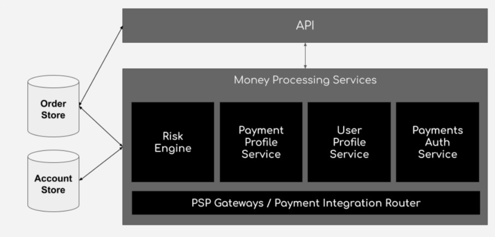
   hình 1

## Triển Khai: Xử Lý Luồng Phân Tán

Ở mức sâu hơn, nền tảng Thanh Toán của chúng ta được triển khai như một tập hợp các microservice được tổ chức theo kiến trúc xử lý luồng. Dữ liệu luồng đề cập đến dữ liệu được tạo ra liên tục, thường với khối lượng lớn và tốc độ cao. Uber xử lý hàng chục triệu giao dịch mỗi ngày, làm cho kiến trúc dựa trên luồng trở thành lựa chọn tự nhiên.

### Công Nghệ Chính: Apache Kafka

Công nghệ chính được sử dụng bởi Nền Tảng Thanh Toán của chúng ta là Apache Kafka: một nền tảng phần mềm xử lý luồng mã nguồn mở

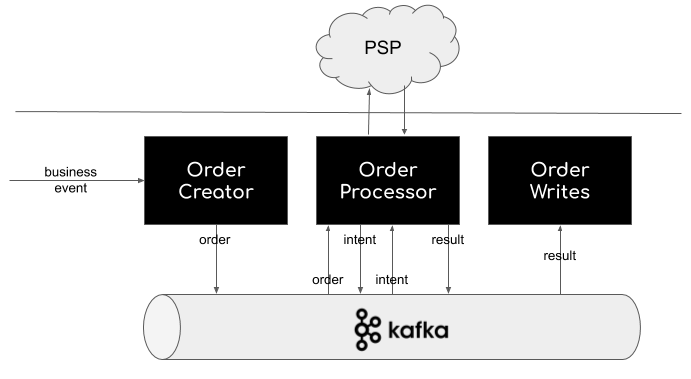
hình 2

Kafka có một số khả năng chính, có thể được kế thừa bởi Nền Tảng Thanh Toán của chúng ta:

- Xuất bản và đăng ký các luồng bản ghi, tương tự như hàng đợi tin nhắn hoặc hệ thống nhắn tin doanh nghiệp.

- Lưu trữ các luồng bản ghi theo cách bền vững và chịu lỗi.

- Xử lý bất đồng bộ các luồng bản ghi khi chúng xảy ra. Xử lý bất đồng bộ phù hợp với các giao dịch trong lĩnh vực thanh toán: xử lý thanh toán đòi hỏi độ tin cậy cao, nhưng có thể được triển khai bất đồng bộ (trong giới hạn thời gian).

- Mở rộng theo chiều ngang để xử lý tải thay đổi.

Các node được kết nối qua Kafka thường là các microservice, có thể được xây dựng bằng Go, Java, NodeJS hoặc Python.

Ngoài ra, Kafka hỗ trợ tốt các yêu cầu hiệu suất và khả năng mở rộng cao. Kafka có khả năng mở rộng theo chiều ngang, chịu lỗi và được tối ưu cho tốc độ, chạy như một cụm trên một hoặc nhiều server có thể trải rộng qua nhiều trung tâm dữ liệu (Ví dụ: Uber sử dụng kết hợp dịch vụ điện toán đám mây của bên thứ ba và trung tâm dữ liệu đặt chung).

## Hiệu Suất và Khả Năng Mở Rộng

Hãy xem ví dụ của Uber để thấy cách Nền Tảng Thanh Toán được triển khai trong thực tế.

Một trong những thách thức kỹ thuật chính mà Uber phải đối mặt trong việc triển khai nền tảng thanh toán là quy mô hoạt động của nó. Để minh họa, đây là một số thống kê gần đây:

65 quốc gia, 600 thành phố,
75 triệu hành khách Uber,
3,9 triệu tài xế Uber,
14 triệu chuyến đi Uber mỗi ngày (đã hoàn thành hơn 10 tỷ chuyến đi trên toàn thế giới).
Ngoài quy mô toàn cầu, tải không đồng đều và có thể có các đỉnh bất ngờ.

Mặc dù chi tiết không có sẵn công khai, các bài thuyết trình kỹ thuật cung cấp một số thông tin về các cơ chế được Uber sử dụng để xử lý các yêu cầu hiệu suất và khả năng mở rộng, chẳng hạn như:

- Song song hóa xử lý mở rộng với [mẫu competing consumers](https://www.enterpriseintegrationpatterns.com/patterns/messaging/CompetingConsumers.html), bằng cách có nhiều instance (micro)service chạy song song

- Mở rộng độc lập các thành phần xử lý, để quản lý linh hoạt hơn dung lượng cần thiết

- Sử dụng khóa lạc quan (optimistic locking), để tránh nhu cầu về cơ chế khóa phân tán phức tạp.

## Độ Tin Cậy

Việc triển khai hệ thống thanh toán dựa trên luồng đáng tin cậy đi kèm với nhiều thách thức:

- Lỗi hệ thống (lỗi có thể xảy ra giữa chừng trong quá trình xử lý)
- Poison pill (tin nhắn đến không thể được tiêu thụ)
- Lỗi chức năng (không có lỗi kỹ thuật, nhưng kết quả không hợp lệ)

Các cơ chế chính để đối phó với yêu cầu độ tin cậy bao gồm:

- Dự phòng của tất cả các dịch vụ, bao gồm cơ sở hạ tầng nhắn tin, cho phép khả năng phục hồi trong các lỗi hệ thống nội bộ,
- Triển khai mẫu guaranteed delivery, bằng cách sử dụng khả năng của Kafka để lưu trữ tin nhắn sao cho chúng không bị mất ngay cả khi hệ thống nhắn tin gặp sự cố,
- Triển khai timeouts, cả trong tích hợp với các hệ thống bên ngoài, cũng như các dịch vụ nội bộ để ngăn quá tải hệ thống lâu dài,
- Thử lại các hoạt động, dựa trên chiến lược lỗi được xác định (xem hình 3), hoặc chuyển tin nhắn vào dead letter queue, để tin nhắn không bao giờ bị mất,
- Triển khai xử lý tin nhắn idempotent cho các hoạt động dịch vụ. Một [hoạt động idempotent](https://stackoverflow.com/questions/1077412/what-is-an-idempotent-operation) là hoạt động không có hiệu ứng bổ sung nếu được gọi nhiều lần với cùng tham số đầu vào. Apache Kafka triển khai chiến lược giao hàng "ít nhất một lần", ngụ ý subscriber có thể nhận cùng một tin nhắn nhiều lần, vì vậy subscriber quản lý trạng thái và gây ra side effect nên triển khai xử lý tin nhắn idempotent.
- Làm mượt tải thông qua hàng đợi, để tránh quá tải các dịch vụ, và
- Xác thực kết quả xử lý dựa trên ghi lại side effect


Hình 3: Xử lý lỗi yêu cầu một chiến lược lỗi. Một lỗi có thể dẫn đến thử lại hoạt động, hoặc đưa nó vào dead message queue (DMQ).

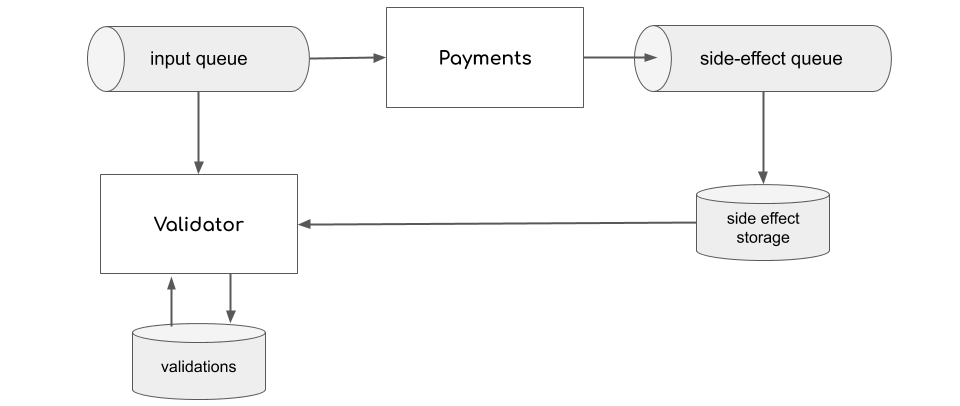
Hình 4: Mỗi hoạt động phức tạp sẽ dẫn đến một số side effect. Một validator có thể kiểm tra tại một thời điểm nào đó xem các side effect thực tế có khớp với các side effect mong đợi không.

## Triển Khai: Tích Hợp với Các Hệ Thống Bên Ngoài

Nền Tảng Thanh Toán tương tác với các nhà cung cấp dịch vụ thanh toán (PSP) và ngân hàng để thực hiện các giao dịch thanh toán.

Mỗi tích hợp với PSP và ngân hàng là khác nhau, chúng ta có thể phân biệt hai kiểu tích hợp (Hình 5):

- Tích hợp dựa trên API với các tích hợp PSP hiện đại, với API dựa trên REST, trao đổi dữ liệu bằng JSON, một giao dịch tại một thời điểm, gần thời gian thực.

- Tích hợp batch kế thừa với ngân hàng, nơi tích hợp được thực hiện bằng cách trao đổi file qua SFTP, với tần suất tương đối thấp (ngày hoặc giờ).

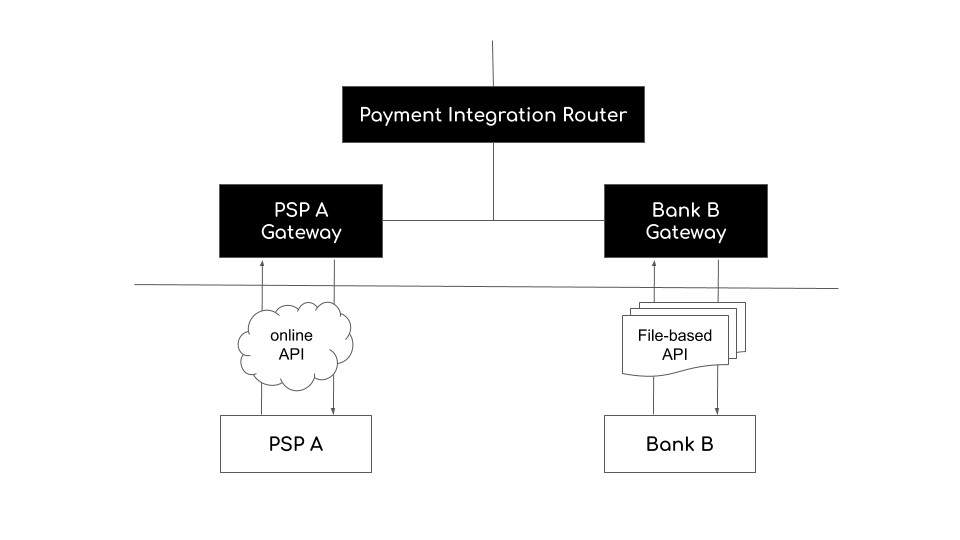
Hình 5: Hai kiểu tích hợp với các hệ thống bên ngoài: dựa trên API và dựa trên file.

Idempotency là một chủ đề thiết yếu trong tích hợp với các hệ thống thanh toán bên ngoài. Điều tốt về các hệ thống PSP và ngân hàng là chúng thường triển khai dịch vụ của mình như là các bộ xử lý tin nhắn idempotent. Idempotency là thiết yếu cho các hệ thống thanh toán vì hai lý do:

- Nó giúp ngăn chặn việc tính phí hai lần
- Nó cải thiện độ tin cậy và đơn giản hóa kiến trúc hệ thống.

Khi xảy ra lỗi (ví dụ: lỗi mạng), có thể khó xác định liệu một số thao tác đã thành công hay thất bại và hệ thống đang ở trạng thái nào. Không có idempotency, ví dụ, việc thử lại các hoạt động có thể rủi ro, vì bạn có thể thực hiện cùng một thao tác hai lần (ví dụ: tính phí khách hàng hai lần cho cùng một dịch vụ).

Với idempotency, bạn có thể lặp lại hoạt động thất bại mà không có lo lắng như vậy. Hình 6 minh họa cách idempotency (trong bối cảnh tích hợp với các hệ thống bên ngoài) hoạt động trong một tình huống lý tưởng.

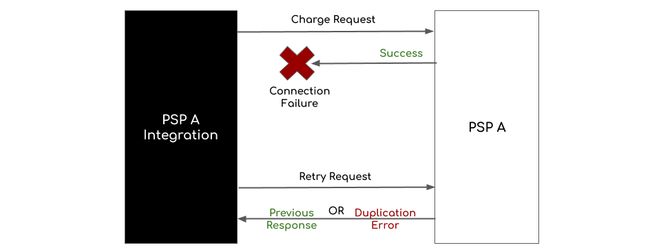
Hình 6: Các hệ thống xử lý tin nhắn idempotent sẽ không xử lý cùng một tin nhắn hai lần.

Tin tốt là tôi đã phát triển webhook handler riêng để giải quyết vấn đề này. Chúng ta cũng có thể áp dụng webhook của Stripe API để giải quyết vấn đề này.

### Các Thách Thức với Idempotency

Idempotency hoạt động tốt nếu bạn lặp lại yêu cầu đối với cùng một hệ thống, với cùng một operation ID. Operation ID cần được cung cấp bởi ứng dụng gọi một dịch vụ idempotent để dịch vụ biết liệu nó đang nhận được yêu cầu mới (ID chưa được xử lý trước đó) hay một hoạt động lặp lại (ID đã được xử lý).

Một thách thức của việc triển khai idempotency khi tương tác với các hệ thống bên ngoài liên quan đến các ID được sử dụng cho các hoạt động idempotent. Các hệ thống thanh toán kế thừa chấp nhận phạm vi giá trị hạn chế hơn cho các ID. Việc xoay vòng cẩn thận và thời gian của các ID như vậy là thiết yếu để tránh hệ thống bên ngoài từ chối yêu cầu thanh toán.

Một thách thức khác là multiplexing PSP:

Các hoạt động thanh toán sử dụng nhiều PSP trong một cấu trúc phức tạp, và một PSP khác có thể được sử dụng nếu thanh toán thất bại với PSP được chọn ban đầu. Thực tiễn như vậy có thể cải thiện tỷ lệ thu, nhưng việc thử lại ngây thơ một hoạt động thất bại trên một PSP khác có thể dẫn đến tính phí hai lần, như được minh họa trong Hình 7.

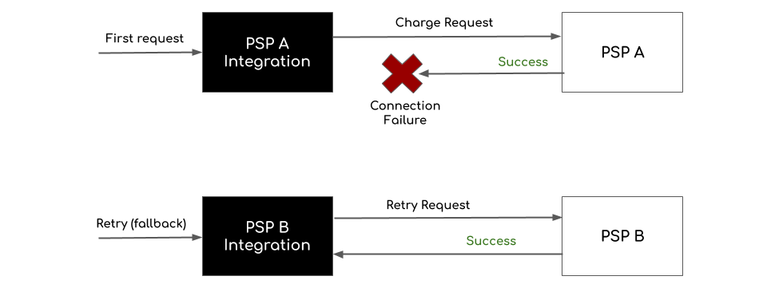
Hình 7: Cách không chính xác để thử lại các hoạt động trong trường hợp lỗi mạng khi làm việc với nhiều PSP. Lỗi mạng không nhất thiết có nghĩa là hoạt động đã thất bại, và việc thử lại hoạt động trên một PSP khác do đó có thể dẫn đến tính phí hai lần.

### Giải Pháp cho vấn đề này:

Sử dụng request storage chuyên dụng khi cần thực hiện retry, để đảm bảo retry quay lại dịch vụ gốc (Hình 8).

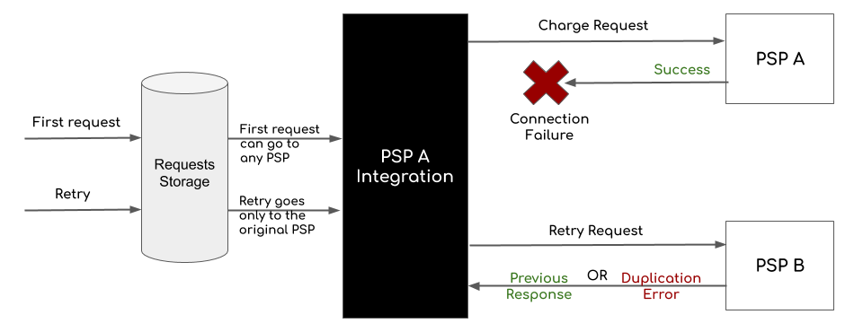
Hình 8: Cách chính xác để thử lại các hoạt động trong trường hợp lỗi mạng khi làm việc với nhiều PSP. Sử dụng request storage chuyên dụng để đảm bảo retry quay lại dịch vụ gốc.

# 👾 Về Kiểm Thử

## Những Hiểu Lầm về Integration Testing và Unit Testing

Trong bối cảnh kiểm thử phần mềm, integration testing và unit testing là hai loại kiểm thử khác nhau phục vụ các mục đích khác nhau.

Unit testing tập trung vào kiểm thử các đơn vị code riêng lẻ trong sự cô lập, thường ở cấp hàm hoặc phương thức. Mục tiêu của unit testing là đảm bảo mỗi đơn vị code hoạt động chính xác một mình, không có phụ thuộc vào các phần khác của hệ thống. Unit test thường được tự động hóa và có thể được chạy thường xuyên như một phần của quy trình tích hợp liên tục.

Integration testing, mặt khác, kiểm thử các tương tác và phụ thuộc giữa các phần khác nhau của hệ thống. Integration test có thể liên quan đến nhiều đơn vị code, các hệ thống con hoặc các hệ thống bên ngoài. Mục tiêu của integration testing là đảm bảo tất cả các phần của hệ thống hoạt động chính xác cùng nhau như một tổng thể.

Trong bối cảnh kiến trúc lục giác, unit test thường kiểm thử hành vi của logic miền lõi trong sự cô lập, trong khi integration test kiểm thử các tương tác và phụ thuộc giữa logic lõi và các adapter (chẳng hạn như cơ sở dữ liệu hoặc API bên ngoài).

Trong cấu trúc được cung cấp, thư mục unit chứa file user_service_test.go, có khả năng chứa các test cho các hàm UserService ở cấp lõi, kiểm thử chức năng của chúng trong sự cô lập với các phần khác của hệ thống.

Thư mục integration chứa file user_integration_test.go, có khả năng chứa các test mô phỏng tương tác giữa UserService và các adapter, chẳng hạn như UserRepository. Các test này có thể sử dụng cơ sở dữ liệu thực hoặc API bên ngoài, và nhằm mục đích kiểm thử hành vi của hệ thống như một tổng thể.

## Benchmarking

Vui lòng đọc bài viết của tôi về [6 Mẹo về Go Hiệu Suất Cao — Các Chủ Đề Go Nâng Cao](https://medium.com/@lordmoma/6-tips-on-high-performance-go-advanced-go-topics-37b601fa329d) để biết thêm thông tin.

Chúng ta đã triển khai benchmarking trên `createUser_test.go` để đảm bảo hiệu suất code không bị giảm sút.

```bash
go test -bench=. -benchmem
```

Đầu ra:

```bash
goos: darwin
goarch: amd64
pkg: github.com/vkhangstack/hexagonal-architecture/internal/adapters/tests/benchmark
cpu: Intel(R) Core(TM) i5-7267U CPU @ 3.10GHz
BenchmarkCreateUser-4                 16          70744288 ns/op           35311 B/op        594 allocs/op
PASS
ok      github.com/vkhangstack/hexagonal-architecture/internal/adapters/tests/benchmark    3.321s
```

Phân tích:

```bash
goos: hệ điều hành mà benchmark được chạy trên đó.
goarch: kiến trúc của bộ xử lý mà benchmark được chạy trên đó.
pkg: package đang được benchmark.
cpu: bộ xử lý đang được sử dụng.
BenchmarkCreateUser-4: tên của benchmark.
"-4" cho biết benchmark được chạy với 4 CPU.
16: số lần lặp được chạy trong benchmark.
70744288 ns/op: thời gian trung bình để chạy một lần lặp của benchmark, đo bằng nanosecond.
35311 B/op: số byte trung bình được cấp phát mỗi lần lặp của benchmark.
594 allocs/op: số lần cấp phát trung bình mỗi lần lặp của benchmark.
```

Trong trường hợp này, benchmark BenchmarkCreateUser được chạy với 16 lần lặp, và mỗi lần lặp mất trung bình 70.744.288 nanosecond (hoặc khoảng 70,7 mili giây) để hoàn thành. Trong mỗi lần lặp, trung bình 35.311 byte được cấp phát và trung bình 594 lần cấp phát được thực hiện.

## Profiling

Vui lòng đọc bài viết của tôi về [6 Mẹo về Go Hiệu Suất Cao — Các Chủ Đề Go Nâng Cao](https://medium.com/@lordmoma/6-tips-on-high-performance-go-advanced-go-topics-37b601fa329d) để biết thêm thông tin.

Go có các công cụ profiling tích hợp sẵn có thể giúp bạn hiểu rõ code của mình đang làm gì. Công cụ profiling phổ biến nhất là CPU profiler, có thể được bật bằng cách thêm cờ -cpuprofile vào lệnh go test.

```bash
go test -cpuprofile=prof.out
```

Đầu ra:

```bash
testing: warning: no tests to run
PASS
ok      github.com/vkhangstack/hexagonal-architecture/internal/adapters/tests/benchmark    1.381s
```

```bash
go tool pprof prof.out
```

Đầu ra:

```bash
Type: cpu
Time: May 11, 2023 at 8:04pm (CST)
Duration: 202.62ms, Total samples = 0
No samples were found with the default sample value type.
Try "sample_index" command to analyze different sample values.
Entering interactive mode (type "help" for commands, "o" for options)
```

Sau khi vào chế độ tương tác trong go tool pprof, bạn có thể sử dụng các lệnh sau để phân tích và tương tác với CPU profile:

```bash
top: Hiển thị các mục hàng đầu trong profile.
list [function]: Hiển thị source code của một hàm, hoặc liệt kê các hàm trong profile.
web: Mở biểu diễn đồ họa của profile trong trình duyệt web mặc định.
focus [function]: Tập trung vào một hàm cụ thể trong profile, ẩn mọi thứ khác.
unfocus: Xóa focus trên một hàm, hiển thị mọi thứ trở lại.
help: Hiển thị danh sách các lệnh có sẵn.
quit: Thoát khỏi chế độ tương tác.
```

### Giới Thiệu về gin-contrib/pprof

Đây là gin middleware pprof. Bạn có thể tìm thấy nó tại https://github.com/gin-contrib/pprof.

Tích hợp pprof:

Trước tiên, cài đặt pprof:

```bash
$ go get github.com/gin-contrib/pprof
```

Sau đó tích hợp pprof vào gin router:

```go
httpRouter := gin.Default()
pprof.Register(httpRouter)
```

Sau khi khởi động server, truy cập `http://localhost:5000/debug/pprof/`

bạn sẽ thấy:

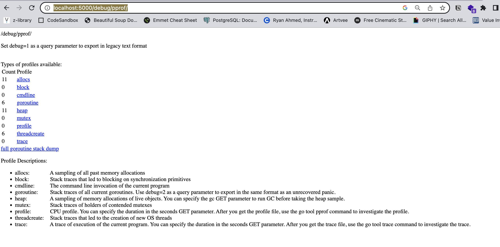

Goroutine: stack trace của tất cả Goroutine hiện tại
CPU: stack trace của CPU được trả về bởi runtime
Heap: lấy mẫu cấp phát bộ nhớ của các đối tượng đang hoạt động
Allocation: lấy mẫu tất cả các cấp phát bộ nhớ trong quá khứ
Thread: stack trace dẫn đến việc tạo OS thread mới
Block: stack trace dẫn đến chặn trên các nguyên thủy đồng bộ hóa
Mutex: stack trace của người giữ các mutex bị tranh chấp

## Đo Lường Hiệu Suất

Chúng ta sẽ đo lường bao nhiêu yêu cầu mỗi giây mà microservice có thể xử lý. Điều này có thể được thực hiện bằng các công cụ tạo tải HTTP.

Cài đặt hey

```bash
brew install hey

sudo apt-get install hey
```

Để kiểm tra hiệu suất của ứng dụng, hãy chạy ứng dụng với lệnh go run cmd/main.go

Sau đó hãy tạo tải cho ứng dụng web như sau:

```bash
hey -n 10000000 -c 8 http://localhost:5000/v1/users
```

Điều này sẽ tạo ra 10.000.000 yêu cầu đến /api/user với tối đa 8 worker chạy đồng thời. Mặc định, hey đặt 50 worker.

đầu ra:

```bash
Summary:
  Total:        199.9452 secs
  Slowest:      0.8245 secs
  Fastest:      0.0004 secs
  Average:      0.0114 secs
  Requests/sec: 703.3378


Response time histogram:
  0.000 [1]     |
  0.083 [137442]|■■■■■■■■■■■■■■■■■■■■■■■■■■■■■■■■■■■■■■■■
  0.165 [2552]  |■
  0.248 [396]   |
  0.330 [137]   |
  0.412 [47]    |
  0.495 [16]    |
  0.577 [17]    |
  0.660 [15]    |
  0.742 [4]     |
  0.824 [2]     |


Latency distribution:
  10% in 0.0012 secs
  25% in 0.0020 secs
  50% in 0.0036 secs
  75% in 0.0066 secs
  90% in 0.0329 secs
  95% in 0.0536 secs
  99% in 0.1218 secs

Details (average, fastest, slowest):
  DNS+dialup:   0.0000 secs, 0.0004 secs, 0.8245 secs
  DNS-lookup:   0.0000 secs, 0.0000 secs, 0.0056 secs
  req write:    0.0000 secs, 0.0000 secs, 0.0022 secs
  resp wait:    0.0111 secs, 0.0004 secs, 0.8243 secs
  resp read:    0.0002 secs, 0.0000 secs, 0.2291 secs

Status code distribution:
  [200] 140629 responses
```

Phân tích cung cấp thông tin về hiệu suất của hệ thống dựa trên tóm tắt, histogram thời gian phản hồi, phân phối độ trễ và chi tiết đã cho. Hãy phân tích thông tin:

Tóm tắt:

- Tổng thời gian: 199,9452 giây: Đây là tổng thời gian của bài kiểm tra hiệu suất.
- Phản hồi chậm nhất: 0,8245 giây: Phản hồi chậm nhất được ghi lại trong quá trình kiểm tra.
- Phản hồi nhanh nhất: 0,0004 giây: Phản hồi nhanh nhất được ghi lại trong quá trình kiểm tra.
- Thời gian phản hồi trung bình: 0,0114 giây: Thời gian phản hồi trung bình trên tất cả các yêu cầu.
- Yêu cầu mỗi giây: 703,3378: Số yêu cầu được xử lý mỗi giây.

Histogram thời gian phản hồi:

Histogram hiển thị phân phối thời gian phản hồi trong các phạm vi khác nhau. Số lượng yêu cầu nằm trong mỗi phạm vi được biểu diễn bằng các thanh dọc.

Phân phối độ trễ:

Phần này hiển thị phân phối thời gian phản hồi dựa trên phân vị.

Ví dụ, 10% yêu cầu có thời gian phản hồi 0,0012 giây hoặc thấp hơn.
90% yêu cầu có thời gian phản hồi 0,0329 giây hoặc thấp hơn.
99% yêu cầu có thời gian phản hồi 0,1218 giây hoặc thấp hơn.

Chi tiết:

Phần chi tiết cung cấp thời gian trung bình, nhanh nhất và chậm nhất cho các giai đoạn khác nhau của chu kỳ yêu cầu-phản hồi.

- DNS+dialup: Thời gian cần thiết cho phân giải DNS và thiết lập kết nối với server.
- DNS-lookup: Thời gian cần thiết chỉ cho phân giải DNS.
- req write: Thời gian cần thiết để ghi yêu cầu vào server.
- resp wait: Thời gian chờ phản hồi của server.
- resp read: Thời gian cần thiết để đọc phản hồi từ server.

Phân phối mã trạng thái:

Số lượng phản hồi cho mỗi mã trạng thái được cung cấp. Trong trường hợp này, có 140.629 phản hồi với mã trạng thái 200 (OK).

Nhìn chung, phân tích này cung cấp thông tin về đặc điểm hiệu suất của hệ thống, bao gồm phân phối thời gian phản hồi, phân vị độ trễ và chi tiết về các giai đoạn khác nhau của chu kỳ yêu cầu-phản hồi. Nó giúp xác định các khu vực có thể cần tối ưu hóa hoặc điều tra thêm để cải thiện hiệu suất của hệ thống.

## Tạo Báo Cáo

Đảm bảo ứng dụng của bạn đang chạy!

### CPU profile

CPU profiler chạy trong 30 giây theo mặc định. Nó sử dụng lấy mẫu để xác định các hàm nào tiêu thụ nhiều thời gian CPU nhất. Go runtime dừng thực thi mỗi 10 mili giây và ghi lại call stack hiện tại của tất cả goroutine đang chạy.

```bash
go tool pprof http://localhost:5000/debug/pprof/profile
```

Sau 30 giây, bạn sẽ thấy kết quả như sau:

```bash
(base) lifuyis-MacBook-Pro:Hexagonal-Architecture davidlee$ go tool pprof http://localhost:5000/debug/pprof/profile
Fetching profile over HTTP from http://localhost:5000/debug/pprof/profile
Saved profile in /Users/davidlee/pprof/pprof.samples.cpu.001.pb.gz
Type: cpu
Time: May 23, 2023 at 12:27am (CST)
Duration: 30s, Total samples = 0
No samples were found with the default sample value type.
Try "sample_index" command to analyze different sample values.
Entering interactive mode (type "help" for commands, "o" for options)
(pprof)
```

Khi pprof vào chế độ tương tác, gõ top, lệnh sẽ hiển thị danh sách các hàm xuất hiện nhiều nhất trong các mẫu được thu thập. Trong trường hợp của chúng ta, đây đều là các hàm runtime và thư viện chuẩn, không hữu ích lắm:

```bash
Entering interactive mode (type "help" for commands, "o" for options)
(pprof) top
Showing nodes accounting for 0, 0% of 0 total
      flat  flat%   sum%        cum   cum%
(pprof)
```

Bây giờ hãy tải một số yêu cầu vào server:

```bash
hey -n 10000000 http://localhost:5000/v1/users
```

Một lần nữa, khi tải profile và xem top:

```bash

```

Hãy kiểm tra điều này trong biểu đồ đồ họa; chúng ta làm điều này bằng cách sử dụng cờ -http.

```bash
go tool pprof -http=:5001 http://localhost:5000/debug/pprof/profile
```

Truy cập `http://localhost:5001`

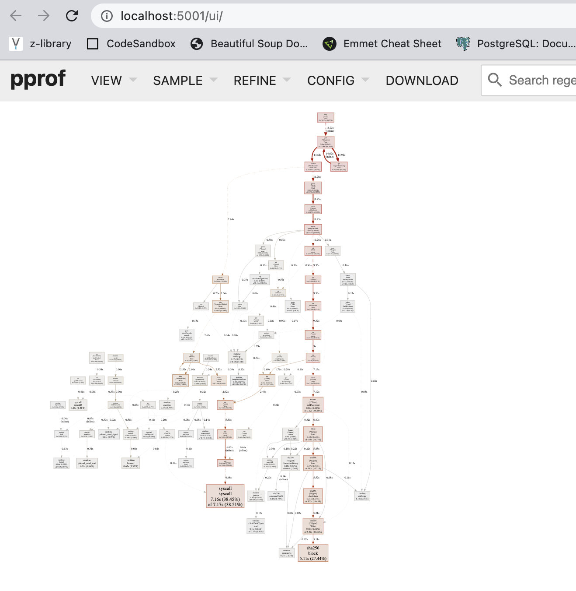

### Cách đọc đồ thị?

Tôi khuyên bạn nên xem qua [phần này](https://github.com/google/pprof/blob/master/doc/README.md#interpreting-the-callgraph) và biết cách bạn có thể đọc đồ thị rõ hơn.

### Heap profile

Chạy heap profiler:

```bash
go tool pprof http://localhost:5000/debug/pprof/heap
```

Trong biểu đồ đồ họa:

```bash
go tool pprof -http=:5003 http://localhost:5000/debug/pprof/heap
```

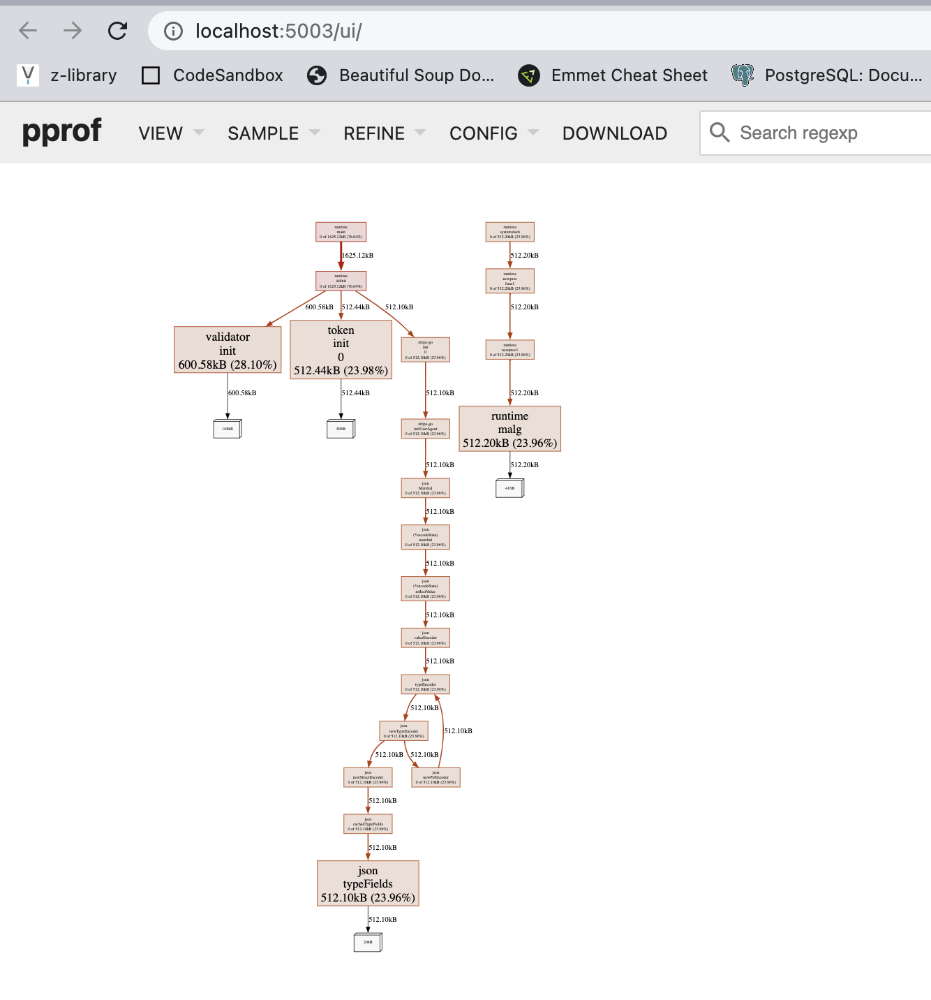

Nhưng chúng ta quan tâm hơn đến số lượng đối tượng được cấp phát. Gọi pprof với tùy chọn -alloc_objects:

```bash
go tool pprof -alloc_objects -http=:5002 http://localhost:5000/debug/pprof/heap
```

### Block profile

Block profile hiển thị các lời gọi hàm dẫn đến chặn trên các nguyên thủy đồng bộ hóa như mutex và channel.

```bash
go tool pprof http://localhost:8080/debug/pprof/block
```

Theo cách này, bạn có thể kiểm tra các profile khác của ứng dụng web.

### Mẹo Tối Ưu

Tránh cấp phát heap không cần thiết.

Đối với các cấu trúc lớn, việc truyền con trỏ có thể rẻ hơn so với sao chép toàn bộ cấu trúc. Nhưng, ưu tiên giá trị hơn con trỏ cho các cấu trúc không lớn.

Trình biên dịch Go đủ thông minh để chuyển một số cấp phát động thành cấp phát stack. Mọi thứ trở nên tệ hơn khi bạn bắt đầu xử lý với interface. Vì vậy, phân bổ trước map và slice nếu bạn biết kích thước trước.
Đừng log nếu bạn không cần.

Sử dụng I/O có buffer nếu bạn thực hiện nhiều lần đọc hoặc ghi tuần tự.
Nếu ứng dụng của bạn sử dụng JSON nhiều, hãy xem xét sử dụng các trình tạo parser/serializer.

Đôi khi nút thắt có thể không phải là những gì bạn đang mong đợi — profiling là cách tốt nhất và đôi khi là cách duy nhất để hiểu hiệu suất thực sự của ứng dụng.

# 🥊 Thêm `tcpdump` để Phân Tích Mạng

Mặc dù Gin cung cấp chức năng logging tích hợp để đo lường và ghi log Round Trip Time (RTT) của các yêu cầu, nhưng có thể có những tình huống bạn muốn sử dụng tcpdump để phân tích mạng. Dưới đây là một số tình huống tcpdump có thể hữu ích:

Khắc phục sự cố mạng: tcpdump có thể được sử dụng để chụp các gói mạng và phân tích nội dung của chúng. Nếu bạn gặp các vấn đề liên quan đến kết nối mạng, mất gói hoặc hành vi không mong đợi, tcpdump có thể giúp bạn kiểm tra lưu lượng mạng để xác định các vấn đề tiềm ẩn.

Phân tích hiệu suất: Trong khi logging tích hợp của Gin cung cấp tổng quan về thời gian xử lý yêu cầu, tcpdump cho phép bạn kiểm tra các gói mạng thực sự được trao đổi giữa client và server. Điều này có thể cung cấp thông tin chi tiết hơn về hiệu suất mạng, bao gồm độ trễ gói, truyền lại và các số liệu cấp mạng khác.

Phân tích bảo mật: tcpdump có thể được sử dụng để chụp và phân tích lưu lượng mạng cho mục đích bảo mật. Nó cho phép bạn kiểm tra payload gói, phát hiện các lỗ hổng tiềm ẩn hoặc điều tra hoạt động mạng đáng ngờ.

Phân tích giao thức: Nếu bạn đang làm việc với các giao thức tùy chỉnh hoặc cần debug các vấn đề cấp giao thức, tcpdump có thể giúp bạn chụp và phân tích các gói cụ thể của giao thức để hiểu luồng giao tiếp và xác định bất kỳ bất thường nào.

Điều quan trọng cần lưu ý là tcpdump hoạt động ở cấp thấp hơn của ngăn xếp mạng so với logging của Gin. Nó chụp tất cả lưu lượng mạng, không chỉ lưu lượng liên quan đến ứng dụng cụ thể của bạn. Điều này có thể cung cấp góc nhìn rộng hơn về hành vi mạng nhưng có thể yêu cầu phân tích và lọc bổ sung để tập trung vào lưu lượng liên quan.

Tóm lại, trong khi logging tích hợp của Gin thường đủ để đo lường RTT của các yêu cầu ứng dụng, tcpdump có thể là một công cụ quý giá để phân tích mạng chuyên sâu, khắc phục sự cố, phân tích hiệu suất và đánh giá bảo mật.

## Để sử dụng tcpdump để khắc phục sự cố mạng, bạn có thể làm theo các bước sau:

### Cài đặt tcpdump:

Đảm bảo tcpdump được cài đặt trên hệ thống của bạn. Quá trình cài đặt có thể khác nhau tùy thuộc vào hệ điều hành.

```bash
brew install tcpdump
```

### Chụp gói mạng:

Chạy tcpdump với các tùy chọn phù hợp để chụp gói mạng. Ví dụ, để chụp tất cả gói trên một giao diện mạng cụ thể (ví dụ: eth0), bạn có thể sử dụng lệnh sau:

```bash
sudo tcpdump -i eth0
```

Điều này sẽ bắt đầu chụp gói mạng trên giao diện được chỉ định. Nếu không hoạt động, hãy sử dụng lệnh `ifconfig` hoặc `ip addr` để liệt kê các giao diện mạng khả dụng trên hệ thống. Tìm giao diện bạn muốn chụp gói. Tên giao diện có thể khác nhau tùy thuộc vào hệ thống và cấu hình mạng của bạn.

### Lọc gói được chụp:

Mặc định, tcpdump chụp tất cả gói trên giao diện được chỉ định. Tuy nhiên, bạn có thể sử dụng bộ lọc để thu hẹp các gói được chụp dựa trên các tiêu chí cụ thể. Bộ lọc có thể dựa trên địa chỉ IP nguồn/đích, số cổng, giao thức, v.v. Ví dụ, để chỉ chụp các gói HTTP, bạn có thể sử dụng lệnh sau:

```bash
sudo tcpdump -i eth0 port 80
```

Điều này sẽ chỉ chụp các gói có cổng đích hoặc nguồn được đặt thành 80 (HTTP).

### Phân tích gói được chụp:

Sau khi tcpdump chụp gói, nó sẽ hiển thị thông tin về mỗi gói theo thời gian thực. Điều này bao gồm các chi tiết như địa chỉ IP nguồn/đích, số cổng, kích thước gói, cờ gói, v.v. Phân tích thông tin này để xác định bất kỳ bất thường hoặc vấn đề nào.

## Mất Gói:

Mất gói đề cập đến tình huống một hoặc nhiều gói mạng không đến được đích. Nó có thể xảy ra do nhiều lý do như tắc nghẽn mạng, thiết bị mạng bị lỗi, độ trễ cao hoặc các vấn đề mạng khác. Mất gói có thể ảnh hưởng tiêu cực đến hiệu suất mạng và dẫn đến hiệu suất ứng dụng bị giảm.

Đây là ví dụ sử dụng tcpdump để chụp gói trên một giao diện mạng cụ thể (eth0) và lọc dựa trên địa chỉ IP nguồn:

```bash
sudo tcpdump -i eth0 src 192.168.1.100
```

Lệnh này sẽ chụp tất cả gói đến từ địa chỉ IP nguồn 192.168.1.100 trên giao diện eth0. Bạn có thể sửa đổi bộ lọc dựa trên yêu cầu cụ thể của mình.

Hãy nhớ chạy tcpdump với quyền phù hợp (ví dụ: sử dụng sudo) để chụp gói hiệu quả. Ngoài ra, tcpdump cung cấp nhiều tùy chọn và bộ lọc để tùy chỉnh quá trình chụp hơn nữa. Bạn có thể tham khảo tài liệu tcpdump hoặc sử dụng lệnh man tcpdump trong terminal để biết thêm thông tin về cách sử dụng và các tùy chọn có sẵn.

Khi bạn chạy sudo tcpdump -i en0, tcpdump bắt đầu chụp gói trên giao diện mạng en0. Mặc định, tcpdump sẽ chụp gói liên tục cho đến khi bạn dừng nó thủ công. Để dừng tcpdump, bạn có thể nhấn Ctrl+C trong terminal nơi nó đang chạy.

Thông tin tóm tắt ở cuối log cung cấp thống kê về các gói được chụp:

```bash
606 packets captured
606 packets received by filter
0 packets dropped by kernel
```

- "606 packets captured" cho biết tổng số gói được tcpdump chụp.
- "606 packets received by filter" cho biết số gói đã vượt qua tiêu chí lọc được chỉ định trong lệnh tcpdump.
- "0 packets dropped by kernel" cho biết không có gói nào bị ngăn xếp mạng/kernel loại bỏ trong quá trình chụp.

## Hướng Dẫn TCPDump

[Hướng Dẫn TCPDump](https://github.com/Samsar4/Ethical-Hacking-Labs/blob/master/11-Bonus/TCPDump-Tutorial.md)

# 🍕 Suy Nghĩ về Việc Amazon Prime Video Từ Bỏ Kiến Trúc AWS Phân Tán Serverless và Chuyển sang "Monolith"

Tôi nghĩ điều quan trọng là một kỹ sư phần mềm phải liên tục theo dõi kiến trúc phần mềm, vì vậy tôi đã đưa chủ đề này ra để thảo luận với trường hợp của Amazon Prime Video như một sự nhìn lại kiến trúc hiện tại của chúng ta.

Dưới đây là những suy nghĩ tôi thu thập từ internet:

- Nút thắt mở rộng chính trong kiến trúc là quản lý điều phối được triển khai bằng AWS Step Functions. Dịch vụ của chúng tôi thực hiện nhiều chuyển đổi trạng thái mỗi giây của luồng, vì vậy chúng tôi nhanh chóng đạt đến giới hạn tài khoản. Ngoài ra, AWS Step Functions tính phí người dùng theo chuyển đổi trạng thái. Vấn đề chi phí thứ hai chúng tôi phát hiện liên quan đến cách chúng tôi truyền các khung video (hình ảnh) giữa các thành phần khác nhau. Để giảm các công việc chuyển đổi video tốn nhiều tính toán, chúng tôi đã xây dựng một microservice chia video thành các khung và tạm thời tải hình ảnh lên S3 bucket. Các detector lỗi (mỗi cái cũng chạy như một microservice riêng biệt) sau đó tải hình ảnh xuống và xử lý chúng đồng thời bằng AWS Lambda. Tuy nhiên, số lượng lớn các cuộc gọi Tier-1 đến S3 bucket rất tốn kém.

- Đối với một số người quan sát, "thiết kế trong bài viết PV [Prime Video] là có vấn đề. Việc sử dụng sai các dịch vụ không sửa chữa các vấn đề kiến trúc, nó phơi bày chúng" như Lambros Petrou, kỹ sư phần mềm cấp cao tại DataDog đã thêm vào Twitter; một quan điểm đến một mức độ nào đó được chia sẻ bởi cựu CTO Steve Chambers, người nói: "Về cơ bản, họ bây giờ sử dụng cùng một kiến trúc nhưng nén các thành phần vào container để họ không có các cuộc gọi và truyền dữ liệu tốn kém qua mạng giữa các dịch vụ đám mây khác nhau… đó là loại tối ưu hóa hiển nhiên!

- Một kỹ sư đã thêm vào cuộc tranh luận Reddit về sự thay đổi: "Microservice có overhead. Những gì từng là giao tiếp inter-process đơn giản hoặc thậm chí là cuộc gọi trong bộ nhớ giữa hai phần nhỏ của hệ thống trở thành một bài tập HTTPS, OAuth, mã hóa/giải mã JSON đầy đủ mỗi khi một trong những cuộc trò chuyện ngắn đó cần xảy ra. Khi hệ thống của bạn bị phá vỡ thành 500.000 mảnh và mỗi giao tiếp yêu cầu thiết lập đó, VÀ bạn đang bị tính phí cho mỗi giao dịch, chi phí và độ phức tạp tích lũy. Phản ứng chống lại monolith là cần thay thế toàn bộ ứng dụng trong một lần, nghĩa là các nhà phát triển thực sự cần phải kiểm tra mọi thứ. DevOps có nghĩa là không còn kiểm tra và chúng ta thất bại trong production, và cách duy nhất bạn có thể làm điều đó là có các phần chức năng nhỏ để bạn có thể tìm/sửa chữa nhanh chóng. Tôi không nghĩ có điều gì sai khi nói những phần của ứng dụng nói chuyện nhiều này thuộc về nhau mà không cần mở hàng triệu kết nối mọi lúc…"
